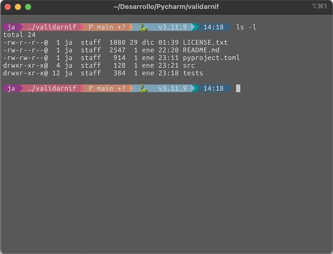

# Script de configuración del terminal para macOS

Este script instala y configura el terminal [iTerm2](https://iterm2.com/) dejándolo listo para su uso de forma reproducible.

## Características

- Instala [Homebrew](https://brew.sh/) si no está instalado.
- Configura e instala:
  - [iTerm2](https://iterm2.com/) (Emulador de terminal).
  - [Ubuntu Mono Nerd Font](https://www.nerdfonts.com/) (Fuente para desarrolladores).
  - [Starship Prompt](https://starship.rs/) (Prompt personalizable).
- Elimina el mensaje de bienvenida predeterminado en los terminales.





## Instalación

1. Clonar el repositorio:
   ```bash
   git clone https://github.com/Sustoja/macbook_setup.git
   cd macbook_setup
   ```

2. Ejecutar el script:
   ```bash
   ./iterm_setup.sh
   ```

## Personalización

- Para modificar la configuración de Starship, hay que editar el archivo `assets/starship/starship_mig.toml` o modificar en el script para cargar otro diferente.
- Agrega o elimina paquetes de Homebrew en la sección `brew bundle` según sea necesario.

## Solución de Problemas

- Si el script falla, comprobar los permisos necesarios:
  ```bash
  chmod +x setup.sh
  ```

- Usa el modificador `--force` para reinstalar paquetes:
  ```bash
  brew reinstall <paquete>
  ```

## Licencia

Este proyecto está licenciado bajo la Licencia MIT. Consulta el archivo [LICENSE](LICENSE) para más detalles.

## Contribuciones

Se agradecen las contribuciones mediante fork del repositorio y solicitudes de pull request.

## Licencia

Este proyecto utiliza la Licencia MIT. Consulte el archivo [LICENSE](LICENSE.txt) para más información.
